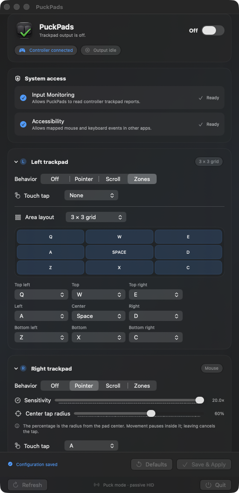
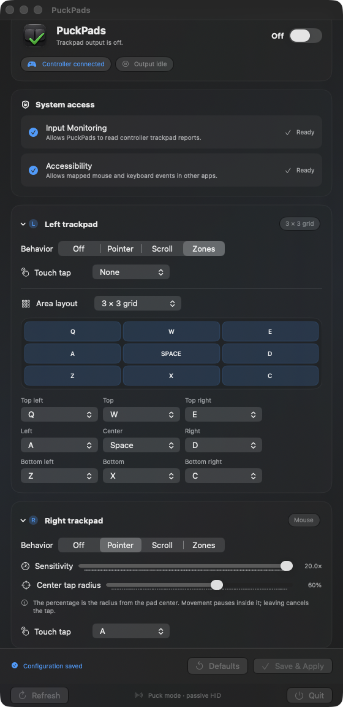

# PuckPads

PuckPads restores useful Steam Controller 2 trackpad behavior alongside macOS 27's native Steam Controller gamepad support. The standalone menu-bar app is the primary way to use it; a CLI is included for development and diagnostics.

> [!WARNING]
> This is an early, hardware-specific beta. macOS 27 Beta 5 only shipped today, and PuckPads was put together very quickly to explore its new Steam Controller support. Expect bugs, incomplete device coverage, and behavior that may change in later macOS betas. Please report reproducible problems in [Issues](https://github.com/zachspartofaday/PuckPads/issues).



Apple's Steam Controller HID service remains responsible for native buttons, sticks, triggers, and gamepad identity. PuckPads passively reads the same Steam Controller 2 puck reports and adds configurable trackpad output:

- pointer movement and scrolling with independent sensitivity;
- keyboard or mouse-button zones in radial four-way, four-corner, left/right, top/bottom, and 3×3 layouts;
- short touch-taps mapped to a key, left click, or right click; and
- a mouse-mode center tap radius that suppresses movement and reserves the center for tapping.



PuckPads does not send controller feature reports. It does not change lizard mode, firmware, IMU, haptics, rumble, or Apple's native gamepad mappings.

## Standalone app — recommended

1. Download the current `PuckPads.app` archive from [Releases](https://github.com/zachspartofaday/PuckPads/releases), or build the app locally using the instructions below.
2. Move it to Applications and launch it.
3. Open PuckPads from its menu-bar icon.
4. Use **Request** for Input Monitoring and Accessibility. The adjacent gear buttons open the matching Privacy & Security panes if macOS previously denied access.
5. Configure each trackpad, then choose **Save & Apply** and turn output on.

The panel expands up to 1,120 points tall while respecting the display's visible frame, minimizing scrolling for expanded pad configurations. Pad sections still collapse independently, and save controls stay pinned below the configuration. Native macOS segmented and pop-up controls adopt the macOS 27 Liquid Glass appearance. PuckPads is built with the macOS 27 SDK while retaining macOS 26.0 as its minimum deployment target in case Apple back-deploys controller support.

The center tap percentage represents radius from the physical pad center: 50% reaches halfway to the edge and 100% reserves the full normalized pad radius.

> [!IMPORTANT]
> The current downloadable beta is ad-hoc signed and is not notarized. It does not have a stable Apple Developer identity, so macOS may request permissions again after an update and may apply additional Gatekeeper restrictions. A Developer ID-signed and notarized release will replace it when that signing identity is available to the build environment.

### Requirements

- macOS 27 Beta 5 with `SteamControllerHIDServicePlugin.plugin` (initially validated on build `26A5406e`)
- Steam Controller 2 connected through the puck (`0x28DE:0x1304`; `0x1305` is recognized but unvalidated)
- Input Monitoring permission to read pad reports
- Accessibility permission to emit mouse, scroll, and keyboard events

Puck/dongle mode is the only confirmed path. Bluetooth and direct USB behavior remain unvalidated.

### Build the app locally

Xcode-beta is currently required:

```bash
DEVELOPER_DIR=/Applications/Xcode-beta.app/Contents/Developer \
BUILD_SCRATCH_PATH="$PWD/.build/xcode27" \
scripts/build-app.sh
open dist/PuckPads.app
```

Local builds are ad-hoc signed unless `SIGN_IDENTITY` is provided. macOS may treat successive ad-hoc builds as different applications and ask for permissions again.

For a distributable Developer ID build:

```bash
SIGN_IDENTITY="Developer ID Application: Your Name (TEAMID)" scripts/build-app.sh
```

Developer ID distribution also requires Apple notarization. The build script signs and verifies the bundle but intentionally does not upload it.

## Configure button zones

Choose **Zones** for either pad and select a native pop-up layout:

- **Radial 4-way** for a conventional D-pad;
- **Four corners** for diagonal quadrants;
- **Left / right** or **Top / bottom** for two large buttons; or
- **3 × 3** for nine independent areas.

Every area can hold a keyboard key, left mouse button, or right mouse button until the touch moves to another area or lifts.

## CLI and configuration

The CLI shares the app's configuration model but is secondary to the standalone app:

```bash
scripts/puck-pads.sh --dry-run
scripts/puck-pads.sh --observe-only --verbose --duration 10
scripts/puck-pads.sh
```

Write or inspect the default configuration at `~/.config/PuckPads/config.json`:

```bash
scripts/puck-pads.sh --write-config ~/.config/PuckPads/config.json
scripts/puck-pads.sh --show-config
```

PuckPads automatically reads the older `~/.config/TracksBack/config.json` and `~/.config/TrackIsBack/config.json` locations when the new path does not exist, so existing settings are not stranded. The next save writes to the new location.

Example mappings:

```bash
# Left pad as WASD
scripts/puck-pads.sh --left-mode dpad \
  --left-up w --left-right d --left-down s --left-left a

# Right-pad center tap as left click
scripts/puck-pads.sh --right-mode mouse \
  --right-mouse-deadzone 0.20 --right-tap mouse-left

# Nine-zone keyboard layout
scripts/puck-pads.sh --left-mode dpad --left-layout grid-nine \
  --left-grid-top-left q --left-grid-center space --left-grid-bottom-right c
```

Run `scripts/puck-pads.sh --help` for every option.

## Known limitations

- Trackpad output is CGEvent mouse, scroll, and keyboard input—not native gamepad axes.
- PuckPads does not suppress or remap Apple's native controller buttons.
- Games may switch prompts or input modes when controller and mouse events alternate.
- Compatibility is expected to move as macOS 27 betas and the HID service plugin change.
- This project has not yet had broad hardware, game, or accessibility-configuration testing.

## Contributing

Issues and focused pull requests are welcome; see [CONTRIBUTING.md](CONTRIBUTING.md). `@zachspartofaday` is the code owner and sole merge authority. Public discussion is welcome, but maintainer approval is required for accepted changes.

## License

PuckPads is available under the [MIT License](LICENSE).
