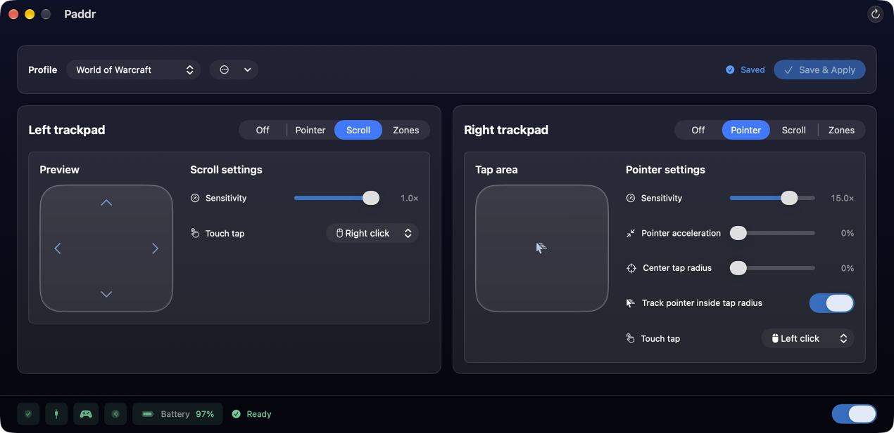
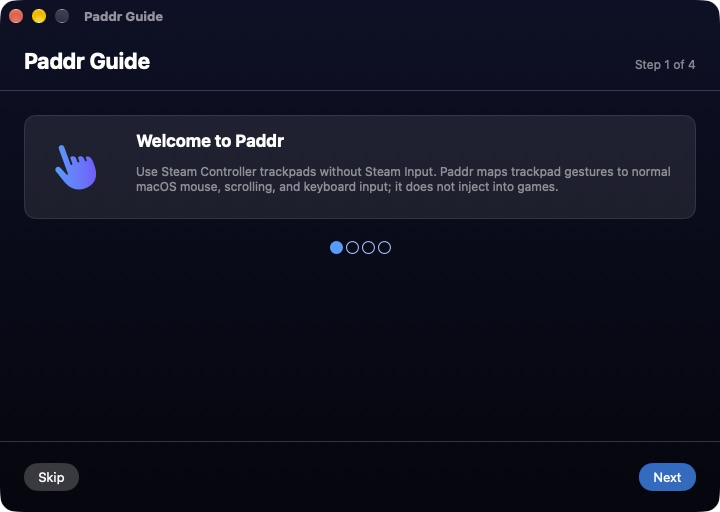
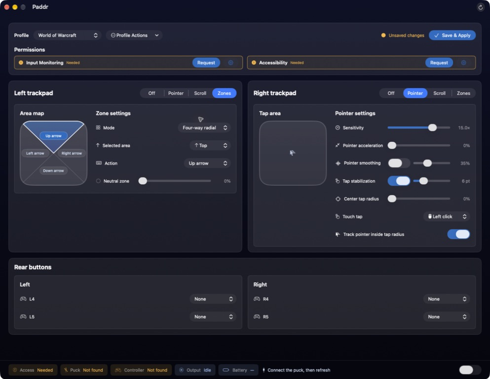
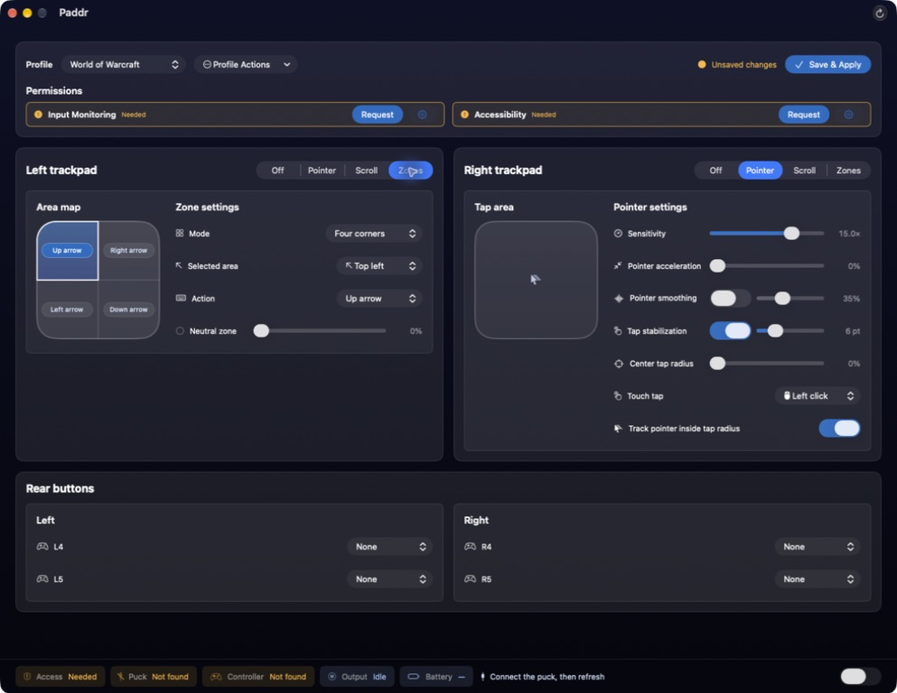
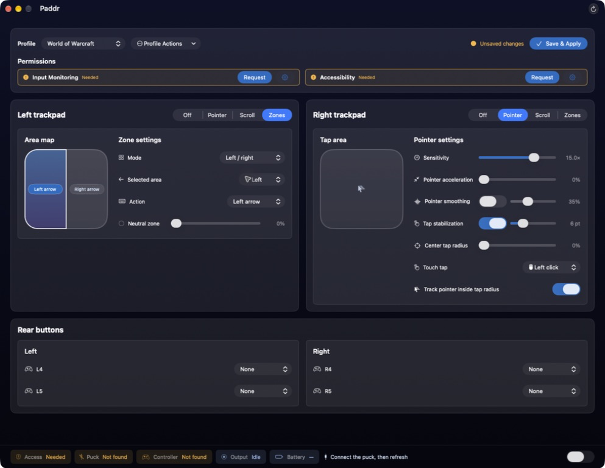
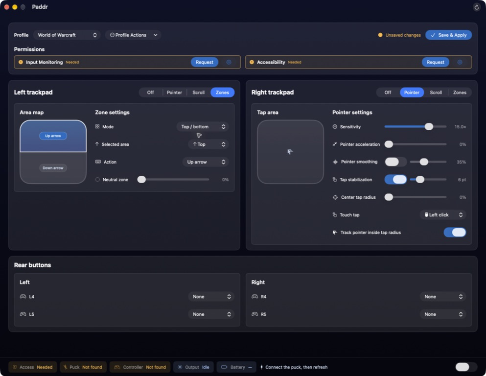
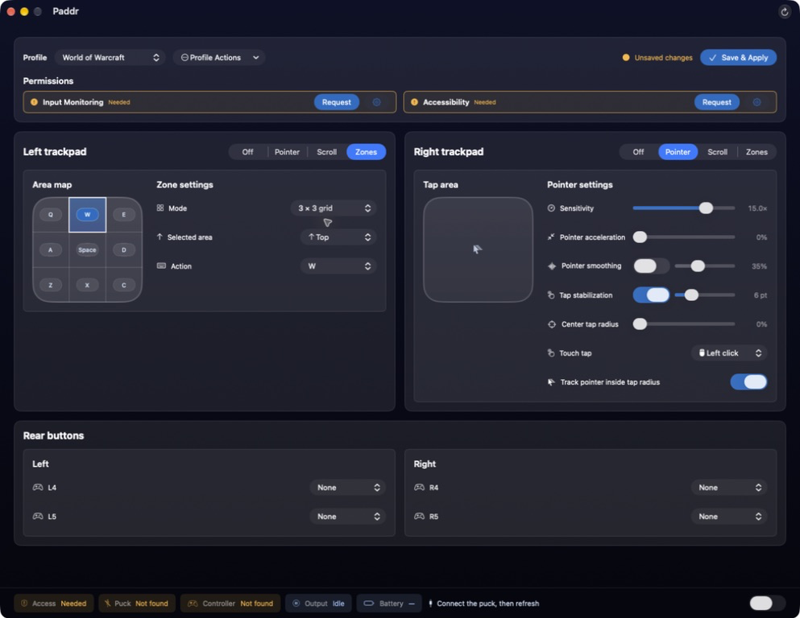

# Paddr

> **TL;DR:** macOS 27 Developer Beta 5 added native Steam Controller 2 support through Apple's `SteamControllerHIDServicePlugin`, allowing a puck-connected controller to appear in the system controller picker and native game APIs. Apple currently omits usable trackpad input. Paddr adds the trackpads back as pointer, scroll, touch-tap, and configurable button-zone input. This depends on an early macOS beta implementation that Apple may change at any time, potentially breaking Paddr until it is updated.

> [!WARNING]
> Paddr is an early, hardware-specific beta confirmed on macOS 27 Developer Beta 5. macOS 27 Public Beta 3 has been released and is likely compatible: a public beta typically corresponds to the preceding developer beta, but the exact build identity and Paddr compatibility have not yet been confirmed. Expect bugs and compatibility changes, and please report reproducible problems in [Issues](https://github.com/zachspartofaday/Paddr/issues).

See [CHANGELOG.md](CHANGELOG.md) for release history and current compatibility notes.



## What Paddr adds

Apple's HID service continues to provide native buttons, sticks, triggers, and controller identity. Paddr passively reads the puck reports and adds:

- **Button Zones:** independently available on either or both pads, with radial four-way, four-corner, left/right, top/bottom, and 3×3 layouts and a separate keyboard key or mouse button for every region;
- pointer mode with independent sensitivity and acceleration for each pad, plus independently adjustable scroll sensitivity;
- touch-taps mapped to a keyboard key, left click, or right click;
- a pointer-mode center tap radius that confines taps to the pad center while pointer tracking uses the full pad by default, with a per-pad switch for restoring the former coupled tracking dead zone; and
- named profiles for saving and quickly switching complete two-pad setups.

The interactive squircle map mirrors runtime hit-testing. Select a region on the map or with the **Selected area** pop-up, then assign its action. Radial, corner, and two-way layouts support an adjustable neutral region; the 3×3 layout dedicates the full pad to nine actions.

Paddr does not send controller feature reports or alter lizard mode, firmware, IMU, haptics, rumble, or Apple's native gamepad mappings. The status bar reports the receiver and the controller separately: **Puck Connected** reflects passive receiver discovery alone, while **Controller Connected** reflects fresh reports from the controller. Both stay accurate while Trackpad Output is off — the toggle controls mapped mouse, scroll, and keyboard emission only, never controller observation. Disabling output releases held mapped keys and mouse buttons before **Output** reads **Idle**, and if controller reports stop, Paddr releases held mapped input and waits for neutral pad input before resuming after reconnect.

## Use the trackpads without Steam Input

Some macOS games are difficult or impossible to add to Steam and launch with Steam Input enabled; **World of Warcraft** is one example. Steam's current macOS method for Steam Controller 2 support depends on that Steam Input launch path.

Paddr does not require Steam to be installed or running. Apple's native controller service continues to provide normal controller inputs while Paddr reads the puck's trackpad reports and emits standard `CGEvent` pointer, scroll, and keyboard actions. Paddr does not inject into the game or rely on Steam Overlay, so directly launched games such as **World of Warcraft** can use the pads through those mapped pointer, scroll, and keyboard inputs.

## Install and use

Requirements:

- macOS 27 Developer Beta 5 with `SteamControllerHIDServicePlugin.plugin` (confirmed); macOS 27 Public Beta 3 is likely compatible but remains unconfirmed;
- Steam Controller 2 connected through the puck; and
- Accessibility permission to read trackpad reports and emit mapped mouse and keyboard events.

Puck mode is the only confirmed connection. Bluetooth and direct USB remain unvalidated.

1. Download `Paddr.zip` from [Releases](https://github.com/zachspartofaday/Paddr/releases).
2. Move `Paddr.app` to Applications and launch it. On first launch, the four-step guide walks through connection, Accessibility, pad setup, and everyday use; reopen it later from Help or the status menu.



3. Grant Accessibility when prompted.


4. Duplicate the built-in **Default** profile, name the copy, configure both trackpads, and choose **Save & Apply**. Default always remains left Scroll/right Pointer and cannot be renamed, edited, or deleted.

Profiles own the complete left/right configuration and keep a stable internal ID when renamed. Use the configuration-window picker to create, duplicate, rename, select, or delete profiles; profile names cannot themselves be UUIDs, keeping name-or-ID selection unambiguous. Switching with unsaved edits asks before discarding them. Deleting the active user profile confirms and activates Default first.

Closing the guide and configuration window leaves Paddr in the menu bar with quick actions for output and saved-profile switching. Paddr appears in the Dock and Command-Tab only while either window is open. Menu switching is unavailable while the configuration window has an unsaved draft; open the window to save or explicitly discard it. The configuration window remains ordinarily resizable but does not support full screen.

## Button Zones

Choose **Zones** independently for either trackpad:

- **Radial 4-way:** conventional D-pad directions;
- **Four corners:** four diagonal quadrants;
- **Left / right** or **Top / bottom:** two large regions; or
- **3 × 3:** nine independent bindings.

| Radial 4-way | Four corners |
| --- | --- |
| [](docs/images/paddr-zones-radial-four-way.png) | [](docs/images/paddr-zones-four-corners.png) |
| Left / right | Top / bottom |
| [](docs/images/paddr-zones-left-right.png) | [](docs/images/paddr-zones-top-bottom.png) |
| 3 × 3 | |
| [](docs/images/paddr-zones-three-by-three.png) | |

Each region can hold a keyboard key, left mouse button, or right mouse button until the touch moves or lifts. Crossing regions releases the previous action before pressing the next one. Non-grid layouts expose a **Neutral zone** control; 3×3 uses the complete pad.

## Build locally

Xcode Beta with the macOS 27 SDK is currently required:

```bash
DEVELOPER_DIR=/Applications/Xcode-beta.app/Contents/Developer \
BUILD_SCRATCH_PATH="$PWD/.build/xcode27" \
scripts/build-app.sh
open dist/Paddr.app
```

Paddr builds for arm64 and retains macOS 26.0 as its deployment target in case Apple back-deploys controller support.

## CLI

The CLI shares the app's canonical profile document and is intended primarily for development and diagnostics:

```bash
scripts/paddr.sh --list-profiles
scripts/paddr.sh --select-profile "Arcade"
scripts/paddr.sh --select-profile 01234567-89ab-cdef-0123-456789abcdef
scripts/paddr.sh --dry-run
scripts/paddr.sh --observe-only --verbose --duration 10
```

Profiles are stored at `~/.config/Paddr/config.json`. On first profile-aware load, an existing raw left/right configuration is atomically migrated: unchanged defaults activate **Default**, while customized values become the active **Previous configuration** profile. Existing raw and canonical configurations retain the former coupled center-radius tracking behavior until changed; fresh profile stores and newly created configurations use full-pad pointer tracking. A failed migration leaves the original file intact and reports its path.

`--list-profiles` prints each name and stable ID; `--select-profile` persists an exact name or ID selection. Use `--profile-store PATH` for a different canonical document. An explicit `--config PATH` remains a read-only compatibility input for an existing legacy raw configuration (or canonical document); invalid paths fail instead of loading defaults. Mapping flags—including per-pad `--left-center-tap-tracking coupled|decoupled` and `--right-center-tap-tracking coupled|decoupled`—change only the effective CLI draft unless `--write-config PATH` persists it. With canonical input, that write preserves the complete profile document and updates its active profile; with legacy raw input, it creates a new canonical document from the effective configuration. Profile list/select operations are mutually exclusive with runtime and mapping options. Run `scripts/paddr.sh --help` for the complete flag list and numeric ranges.

Example:

```bash
# Left pad as a nine-zone keyboard grid
scripts/paddr.sh --left-mode dpad --left-layout grid-nine \
  --left-grid-top-left q --left-grid-center space --left-grid-bottom-right c
```

## Limitations and roadmap

- Output is CGEvent mouse, scroll, and keyboard input—not native gamepad axes.
- Paddr does not suppress or remap Apple's native controller buttons.
- Games may switch prompts when controller and mouse input alternate.
- macOS beta or HID service changes may break compatibility.
- Broad hardware and game testing is still needed.
- Per-game and per-app profiles are planned for a future release.

## Planned features

- Additional Zone Layouts
- Custom Zone Layouts

## Known issues

- Games with dynamic glyphs / control-icon indicators may switch back and forth between controller button icons and keyboard binds.

## Contributing

Issues and focused pull requests are welcome; see [CONTRIBUTING.md](CONTRIBUTING.md). `@zachspartofaday` is the code owner and sole merge authority.

## License

Paddr is available under the [MIT License](LICENSE).
